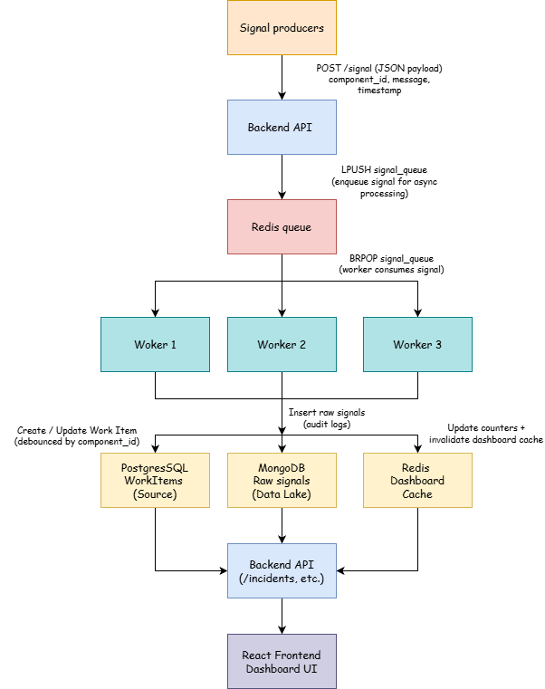
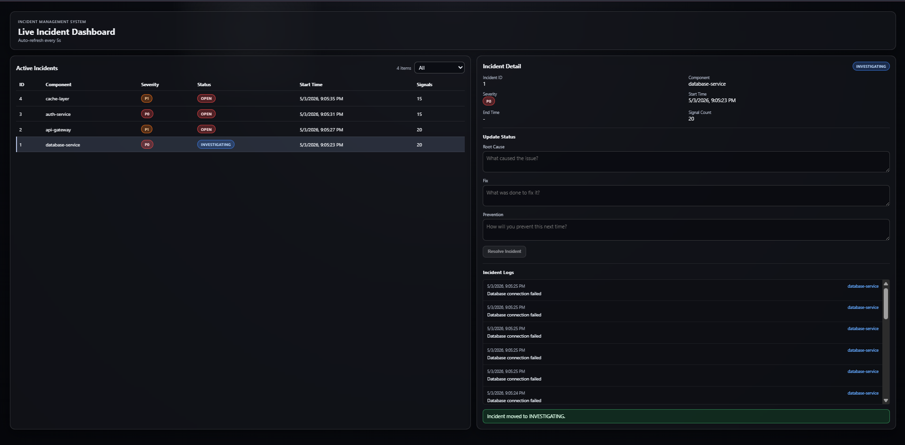
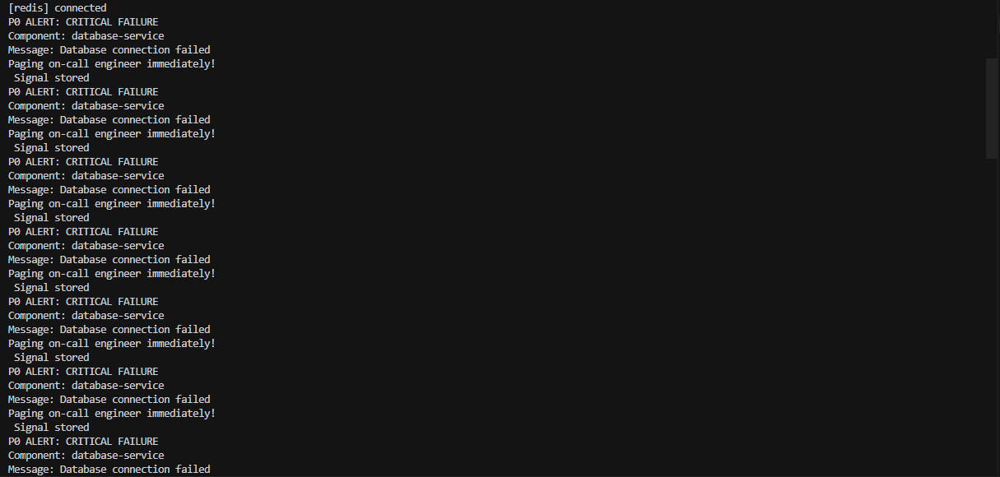
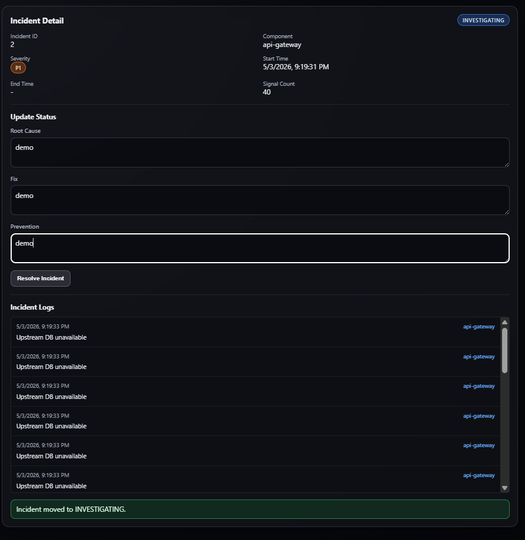
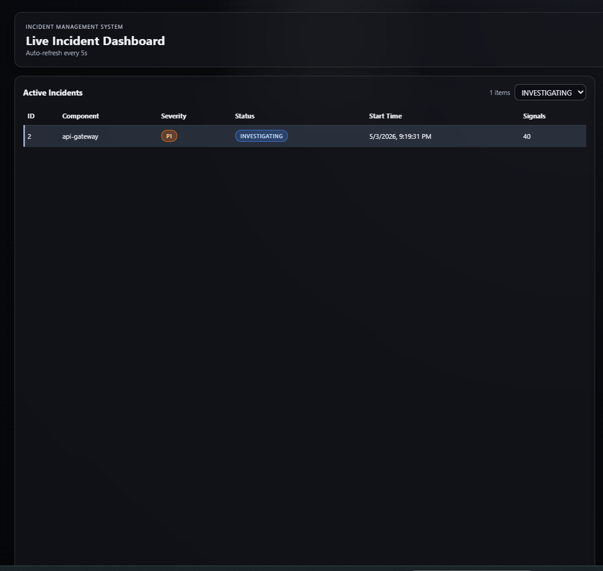

# Incident Management System (IMS)

A scalable, distributed Incident Management System designed to ingest high-volume signals, process them asynchronously, and manage incidents through a structured workflow with real-time visibility.

---

# Overview

Modern distributed systems generate thousands of signals (errors, latency spikes, failures). This system simulates a production-grade pipeline that:

* Ingests signals at high throughput
* Buffers and processes them asynchronously
* Groups related signals into incidents (debouncing)
* Tracks incidents through a workflow lifecycle
* Requires Root Cause Analysis (RCA) before closure
* Provides a real-time dashboard for monitoring

---

# Architecture Diagram



---

# Tech Stack

* **Frontend:** React (Vite)
* **Backend:** Node.js + Express
* **Queue & Cache:** Redis
* **Database (Source of Truth):** PostgreSQL
* **Data Lake:** MongoDB
* **Containerization:** Docker + Docker Compose

---

# Key Features

## 1. High Throughput Ingestion

* Handles burst traffic (~2000–4000 req/sec locally tested)
* Non-blocking ingestion via Redis queue

## 2. Async Processing

* Worker-based architecture
* Decouples ingestion from persistence

## 3. Debouncing Logic

* Multiple signals for same `component_id` grouped into one incident
* Prevents incident explosion

## 4. Multi-Layer Storage

* MongoDB → raw signals (audit log)
* PostgreSQL → structured incidents + RCA
* Redis → hot-path dashboard cache

## 5. Workflow Engine

Incident lifecycle:

```
OPEN → INVESTIGATING → RESOLVED → CLOSED
```

* Enforced transitions
* State-based behavior

## 6. Mandatory RCA

* Incident cannot move to CLOSED without:

  * Root cause
  * Fix applied
  * Prevention steps

## 7. MTTR Calculation

* Automatically computed from:

```
start_time → end_time
```

## 8. Rate Limiting

* Protects ingestion API from overload

## 9. Real-Time Dashboard

* Polling every 5 seconds
* Cached responses for fast UI

---

# Alerting Strategy

Implemented using the **Strategy Pattern**:

* **P0 (Critical):** Immediate alert (simulated paging)
* **P1 (Warning):** Notification (simulated)
* **P2 (Low):** Logged only

This can be extended to:

* Slack
* Email
* PagerDuty

---

# Backpressure Handling (IMPORTANT)

To handle bursts up to **10,000 signals/sec**:

* Incoming signals are pushed to **Redis queue**
* Workers consume asynchronously
* Prevents DB overload
* Ensures system stability under load

```
API → Redis Queue → Worker → DB
```

This decoupling ensures the system does not crash even if persistence is slow.

---

# Load Testing

Tested using:

```bash
autocannon -c 100 -d 10 http://localhost:3000/signal
```

Results:

* ~3500 req/sec
* ~25ms avg latency
* Stable under concurrency

---

# Failure Simulation (Sample Data)

## 1. RDBMS Outage

Simulates cascading failure:

1. Database goes down (P0)
2. API failures (P1)
3. Auth failures (P1)
4. Cache strain (P2)

Run:

```bash
node backend/scenarios/rdbms-outage.js
```

---

## 2. MCP Host Failure

Simulates config/control plane failure:

1. MCP unavailable (P0)
2. Services misconfigured (P1)
3. Auth/API failures (P1)
4. Monitoring detects instability (P2)

Run:

```bash
node backend/scenarios/mcp-outage.js
```

---

# Setup Instructions (Docker)

## 1. Clone repository

```bash
git clone <repo-url>
cd zeotap-IMS
```

---

## 2. Start system

```bash
docker compose up --build --scale worker=3
```

---

## 3. Access services

* Frontend: http://localhost:5173
* Backend API: http://localhost:3000

---

## 4. Generate data

```bash
node backend/scenarios/rdbms-outage.js
```

---

#  API Endpoints

### Signal Ingestion

```
POST /signal
```

### Incidents

```
GET /incidents
GET /incidents/:id
```

### Logs

```
GET /incidents/:id/logs
```

### Status Update

```
POST /workitem/:id/status
```

### Health

```
GET /health
```

---

# Notable Challenge: Cache Invalidation

The dashboard used multiple Redis keys:

```
dashboard:all
dashboard:status:*
dashboard:incident:<id>
```

### Problem

Partial invalidation caused stale UI (list vs detail mismatch).

### Fix

Centralized cache invalidation:

```
DEL dashboard:*
```

after every write operation.

Ensures consistency across all views.

---

# Project Structure

```
/backend
  /api
  /workers
  /services
  /scenarios
/frontend
  src/
docker-compose.yml
README.md
```

---
## 📸 Screenshots

### 🔹 Dashboard



---
  
### 🔹 Incident Detail View



---

### 🔹 RCA Form



---

### 🔹 Status Update


--- 

# Prompts / Specs / Plans

All prompts, design notes, and planning markdowns used to build this system are included in the repository for transparency and reproducibility.

---

# Bonus Features

* Scenario-based failure simulation (RDBMS + MCP)
* Cache consistency handling
* Horizontal scaling via workers
* Realistic incident lifecycle
* Production-style architecture

---

# Conclusion

This project demonstrates:

* Scalable ingestion pipeline
* Async distributed processing
* Multi-database architecture
* Cache optimization and invalidation
* Real-time incident tracking
* Robust workflow enforcement

---

# Author

Amogh Lokhande
DevOps / Backend Engineer
